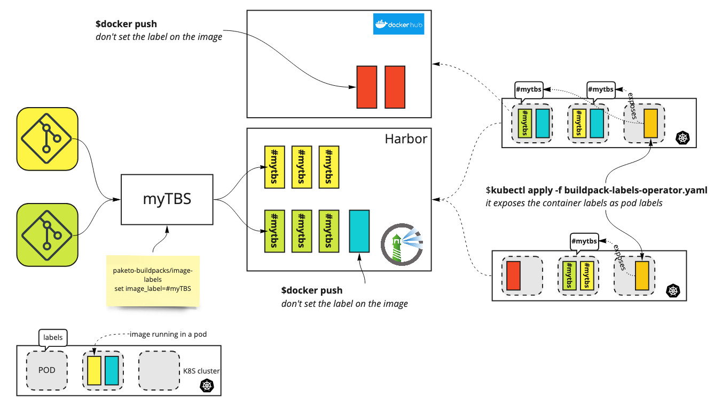

# BUILD PACK LABELS OPERATOR

This kubernetes operator watch pods. It inspects all the managed images running in pods. If one of them comes from the `WATCHED_REGISTRY` and contains Labels put at build time by `kPack` or [Tanzu Build Service](https://tanzu.vmware.com/build-service) starting with `PREFIX_IMAGE_LABEL` then all these labeks will be applied on the running pod using the `PREFIX_POD_LABEL`.

## Use Case

It can be smart to know which images built by a `kpack`service (ex [Tanzu Build Service](https://tanzu.vmware.com/build-service)) are running on which kubernetes clusters to measure the effiency of the service : how many time a single images has been deployed on the several clusters, how many clusters are consumming the image built by the service,....

1. Identify the image

At *build* time, configure custom labels that will be applied. 2 way to achieve that using: 
* configure the [paketo-buildpacks/image-labels](https://github.com/paketo-buildpacks/image-labels) buildpack that is based a environment variable and a naming convention.
* create a custom buildpack that provides the values without any impact ton the project  [watermark-labels-buildpack](https://github.com/bmoussaud/watermark-labels-buildpack)

2. Install this operator

To build the image 
````
make docker-build
make docker-push
````

````
make deploy
````

or 

````
cd config/manager && kustomize edit set image controller=harbor.mytanzu.xyz/library/buildpack-labels-operator
kustomize build config/default | kubectl apply -f -
````

3. Query the pods

The following command return all the pods that match one of the labels

````
kubectl get pods -A -l tanzu-build-service/kpack.builder.instance=tbs-2 -o wide
````




## Configuration

Environment Variables:
* WATCHED_REGISTRY : only images coming from the public registry will be managed (ie whose image value start with ...). Ex if image: docker.io/lklkmskfms:v1, the WATCHED_REGISTRY's value should be docker.io.
* PREFIX_IMAGE_LABEL: fetch the labels that start with this value.
* PREFIX_POD_LABEL: the prefix set on the pod's label. Eg if PREFIX_POD_LABEL=tanzu then all the pods'labels will be `tanzu/<container-label>`
* REQUEST_DEBUG: if `true`, the operator dumps the results to the call to the registry

Edit the values defined in [`config/manager/operator-config.yaml`](config/manager/operator-config.yaml)

## Known limitation:

* don't manage non public registries

## Source

The controler is based on this article [Get labels of remote docker image](https://stackoverflow.com/questions/62600611/get-labels-of-remote-docker-image)
The implementation is using an operator but the result could be done by running a bash script that queries all the running pod and executes the 2 following request to fetch the labels.

```
# get_digest.sh
registry="harbor.mytanzu.xyz"
repo="library/cnb-nodejs"
digest=$(curl https://${registry}/v2/${repo}/manifests/latest | jq -r .config.digest)
curl -H "Accept: application/vnd.docker.distribution.manifest.v2+json"  -s -L "https://${registry}/v2/${repo}/blobs/${digest}" | jq .
````
